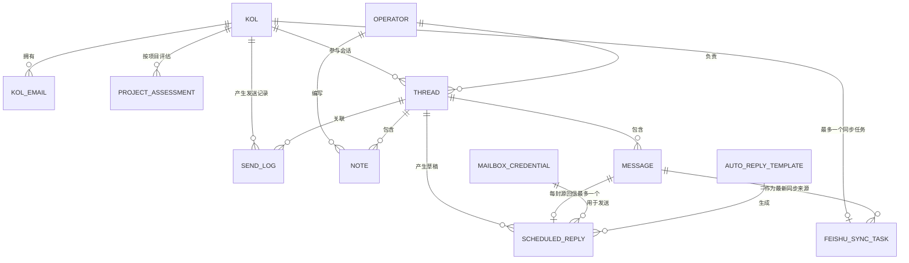

# 数据库开发规范

> 适用范围：`backend/models/`、`backend/alembic/`、数据库读写服务、数据导入以及飞书同步。
>
> 本文描述当前项目的数据库约定、强制限制和修改流程。字段的数据来源与业务含义另见
> [DATA_CONSTRAINTS.md](./DATA_CONSTRAINTS.md)；两份文档冲突时，先停止改动并同时核对
> Alembic、ORM 模型和生产库，不得凭其中一份文档直接修改生产数据。
>
> 最后更新：2026-07-24

---

## 1. 核心原则

1. **PostgreSQL 生产库是业务数据的唯一权威源**。飞书是数据库生成的运营视图，不是主数据库。
2. **Alembic 是生产数据库结构的唯一变更入口**。`Base.metadata.create_all()` 只允许用于本地空 SQLite 库。
3. **数据库约束优先于代码约定**。需要长期成立的唯一性、引用完整性和合法取值，应尽量由
   `UNIQUE`、`FOREIGN KEY`、`NOT NULL`、`CHECK` 等数据库约束保证。
4. **未知值使用 `NULL`，真实的零使用 `0`**。不得用空字符串、`0`、`未提供`混合表达“未知”。
   `未提供`、`待采集`等仅是展示层占位符，不写回业务字段。
5. **同步必须幂等**。重复接收 webhook、重复执行导入、重新分析历史邮件或重新推送飞书，
   都不应产生重复业务记录。
6. **先扩展、后回填、再收缩**。生产库禁止在一个版本内直接删除或改变仍被旧代码读取的字段。
7. **不删除原始证据**。外部 API 原始响应、邮件正文、附件元数据和分析快照应保留，以便审计和重算。

---

## 2. 数据权威边界

| 数据 | 权威位置 | 外部系统角色 | 写入限制 |
|---|---|---|---|
| KOL 身份和画像 | `kol`、`kol_email`、`project_assessment` | Snov/Excel/爬虫是数据来源 | 按字段来源和覆盖规则合并 |
| 候选池 | `kol_candidate` | Excel/爬虫是数据来源 | 用平台与账号幂等导入 |
| 邮件与附件元数据 | `thread`、`message` | Snov/IMAP 是数据来源 | 每封邮件只入库一次 |
| AI 分析 | `message.ai_analysis` | DeepSeek/OpenAI 是计算服务 | 保留每封邮件的分析结果 |
| 会话汇总意向 | `thread.last_intent` 等 | 由最新有效回信计算 | 自动回复不得更新有效意向 |
| 飞书同步状态 | `feishu_sync_task` | 飞书是下游展示 | 一名 KOL 只保留一个持久任务 |
| 飞书运营手填列 | 飞书 | 运营人员维护 | 数据库同步不得覆盖 |
| 邮箱凭据 | `mailbox_credential` | IMAP/SMTP 消费 | 只存密文，不得返回明文 |

飞书中以下列由运营人员负责，当前同步程序必须保留已有值：

- `代理商名称`
- `最近1个月发稿1次日期`
- `最近10条阅读数`
- `最近10条互动数`
- `达人账号认证信息`
- `CPM`

其余飞书列由数据库和分析结果生成。同步以 `系统KOL ID` 为稳定行键，邮箱仅作为旧数据兼容键。
飞书人工调整列顺序不影响同步，但不得制造重复的 `系统KOL ID` 行；发生重复时任务进入
`conflict`，等待人工确认，系统不得擅自删行。

---

## 3. 当前表关系和约束



### 3.1 数据库已经强制的约束

| 对象 | 已强制约束 | 含义 |
|---|---|---|
| `kol_email` | `UNIQUE(kol_id, email_normalized)` | 同一 KOL 不重复保存同一个邮箱 |
| `project_assessment` | `UNIQUE(project_code, kol_id)` | 一名 KOL 在同一项目只有一份评估 |
| `project_assessment.fit_status` | Alembic 中有 `CHECK(fit/not_fit)` | `NULL` 表示未知 |
| `kol_candidate` | `UNIQUE(platform, account)` | 同平台账号唯一；同一人跨平台可有多行 |
| `crawler_product` | `UNIQUE(name_normalized)` | 产品名规范化后唯一 |
| `operator.email` | `UNIQUE` | 运营登录邮箱唯一 |
| `message.message_id` | `UNIQUE` | provider 消息键幂等；允许多个 `NULL` |
| `mailbox_credential.email` | `UNIQUE` | 每个发信邮箱只有一套凭据 |
| `auto_reply_template.scope_key` | `UNIQUE` | 每个模板作用域只有一个当前模板 |
| `scheduled_reply.source_message_id` | `UNIQUE` | 一封入站邮件最多一个自动回复草稿 |
| `feishu_sync_task.kol_id` | `UNIQUE` | 一名 KOL 最多一个飞书同步任务 |
| `kol_email.kol_id` | `ON DELETE CASCADE` | 删除 KOL 时删除其邮箱子记录 |
| `project_assessment.kol_id` | `ON DELETE CASCADE` | 删除 KOL 时删除其项目评估 |

### 3.2 目前仅由业务代码保证的约束

以下规则**尚未全部由数据库强制**，新增写入路径必须主动遵守；需要加强时应新增迁移，
不能只修改文档：

| 业务规则 | 当前实现 | 风险 |
|---|---|---|
| 每名 KOL 只有一个主邮箱 | 导入/服务代码设置 `is_primary` | 数据库允许多个 `is_primary=true` |
| 一名 KOL 在同一 Campaign 只有一个 thread | webhook/同步逻辑查找复用 | 没有 `UNIQUE(kol_id, campaign_id)` |
| `kol.email` 规范化后全局唯一 | 旧库启动兼容逻辑尝试创建唯一表达式索引 | baseline migration 漏了 `unique=True`，不同环境可能不一致 |
| 状态、方向、意向只能取固定枚举 | 服务代码赋值 | 多数列没有 `CHECK` |
| `intent_score` 在 0–100 | AI/服务代码校验 | 数据库未限制范围 |
| 自动回复和休假回复不进最终飞书 | `feishu_push.py` 过滤 | `message` 仍正常保存，不能靠删邮件实现 |
| 飞书运营列不被覆盖 | 飞书 upsert 服务按列保护 | 数据库本身无法约束外部表格 |
| 附件必须属于对应邮件 | 抓取服务按 Message-ID/邮箱/时间匹配 | `attachments` 是 JSON，没有附件子表 FK |
| JSON 字段结构固定 | 生产者和消费者约定 | 数据库未验证 JSON Schema |

### 3.3 删除行为必须显式理解

- 只有 `kol_email.kol_id` 和 `project_assessment.kol_id` 当前声明了数据库级
  `ON DELETE CASCADE`。
- `Thread.messages` 的 `cascade="all, delete-orphan"` 是 **ORM 行为**，不等于数据库
  外键级联。直接执行 SQL 删除 thread 时不能依赖它。
- `thread`、`message`、`note`、`send_log`、`scheduled_reply`、`feishu_sync_task`
  的多数外键没有 `ON DELETE`。删除父记录可能失败，或需要先按依赖顺序处理。
- 业务数据默认只允许软停用或改状态。任何 KOL、thread、message 的物理删除都要先列出
  影响记录数、备份和恢复方式。

---

## 4. 表和字段设计规范

### 4.1 命名

- 表名、列名、索引名使用小写 `snake_case`。
- 现有表使用单数名，新表继续保持一致。
- 主键统一为 `id`；外键为 `<目标表>_id`。
- 约束名：
  - 唯一约束：`uq_<表>_<字段>`
  - 检查约束：`ck_<表>_<语义>`
  - 普通索引：`ix_<表>_<字段>`
  - 特殊唯一索引：`ux_<表>_<语义>`
- 布尔列用 `is_`、`has_`、`enabled` 等可读名称。
- 时间列用 `_at`；日期列用 `_date`，不得混用。

### 4.2 必填与空值

- 业务上创建时不可缺少的字段必须为 `nullable=False`。
- 可选字段使用 `NULL`，不使用 `""`、`"null"`、`"未提供"`代替。
- 新增非空列时必须分阶段：

  1. 先新增为 nullable，或提供仅用于迁移的 `server_default`；
  2. 回填并验证 `NULL` 数量为 0；
  3. 再设置 `NOT NULL`；
  4. 若默认值不是业务真实默认值，移除 `server_default`。

- SQLAlchemy 的 `default=` 只在 ORM 写入时生效；迁移、原生 SQL 和其他客户端看不到。
  数据库必须具备默认值时，要在 Alembic 中声明 `server_default=`。

### 4.3 唯一键和幂等键

- 外部 API 的临时 ID、页内序号或可能变化的 prospect ID 不得直接作为唯一业务键。
- 邮箱参与比较前统一执行 `strip().lower()`；展示时可保留原始邮箱。
- 新增唯一约束前必须先查询重复数据，形成待确认清单。不得为了通过迁移而静默删除重复行。
- 可空唯一列需要明确 `NULL` 语义。PostgreSQL 和 SQLite 通常允许多行 `NULL`，
  不能误以为 `UNIQUE` 会限制“只能有一个空值”。
- 复合业务身份必须用复合唯一约束表达，不能只依赖“先查询再插入”。

### 4.4 外键

- 新外键必须明确：

  - 父记录删除时是 `CASCADE`、`SET NULL` 还是禁止删除；
  - 子表查询是否需要索引；
  - 是否允许暂时没有父记录；
  - 历史记录是否必须保留。

- 高频 join 和队列筛选使用的外键应建索引。
- `CASCADE` 只用于“离开父记录便没有独立意义”的从属数据。审计日志、邮件和发送历史
  通常不应无条件级联删除。
- ORM `relationship(cascade=...)` 与数据库 `ForeignKey(ondelete=...)` 必须分别审查。

### 4.5 状态和枚举

- 状态列的合法值应在一个代码模块中集中定义，并在数据库中增加对应 `CHECK`。
- 新增状态必须同时检查：

  - 生产者；
  - 所有消费者和筛选查询；
  - 定时任务；
  - API schema；
  - 前端显示；
  - 飞书同步；
  - 历史数据回填；
  - 数据库 `CHECK`。

- 禁止复用一个状态表达两个维度。例如“联系人生命周期”“邮件投递状态”“飞书同步状态”
  必须是不同字段。

### 4.6 金额和报价

- 邮件原文中的完整报价属于 `message.ai_analysis.complete_quote`，必须保留平台、形式、
  套餐、数量阶梯和币种，不能只保留一个数字。
- 最低报价是可重算的派生值，不得反向覆盖完整报价。
- 结构化报价项至少应包含：

  ```json
  {
    "amount": 1200,
    "currency": "USD",
    "deliverable": "Dedicated video",
    "evidence": "$1,200 USD dedicated video"
  }
  ```

- 金额需要参与排序或统计时应使用 `Numeric/Decimal`，禁止使用浮点数作为持久化金额。
- 不同币种不得在没有汇率来源、汇率日期和换算规则时直接比较或合并。

### 4.7 JSON

当前 JSON 字段包括 KOL 原始数据、近期视频、邮件附件、AI 分析、报价快照和模板快照等。

- JSON 适合保存外部原始响应、分析快照和结构可能扩展的附属信息。
- 需要唯一约束、外键、频繁筛选或独立生命周期的数据必须拆表，不能继续塞入 JSON。
- JSON 顶层 key 使用稳定英文 `snake_case`。
- 修改 JSON 结构必须做到旧数据可读。破坏性修改应增加 `schema_version` 并提供回填脚本。
- `message.attachments` 只保存附件元数据，不保存密码和访问令牌；附件二进制存储路径由
  附件服务管理。
- `snov_raw_data` 是审计证据，导入过程不得清洗覆盖，只能保存新的完整快照或明确版本。

### 4.8 时间

- 应用当前统一用 UTC 写入，调用 `datetime.utcnow()`；飞书展示前再格式化。
- 同一个业务概念只保留一个权威时间。当前飞书只展示 `回信时间`，不再同时展示
  `时间戳`和`更新时间`。
- 新功能不得混用本地时区时间和 UTC。
- 当前 ORM 与部分迁移对 `timezone=True` 的声明并不完全一致，这是历史债务。
  在统一为时区感知时间前，不得局部引入一半 aware、一半 naive 的 datetime 比较。

### 4.9 索引

- 只为实际查询、join、排序、唯一性和队列领取建立索引。
- 提交索引时写明对应查询；不要为每一列机械建索引。
- 复合索引列顺序按常见过滤前缀设计。
- 新索引上线前用生产规模数据检查执行计划和写入成本。
- PostgreSQL 大表需要在线建索引时，评估 `CREATE INDEX CONCURRENTLY` 与 Alembic
  事务的兼容方式；SQLite 本地测试不能证明生产建索引无锁。

---

## 5. 领域约束

### 5.1 KOL、邮箱和候选池

- `kol` 是已进入外联业务的联系人主表；`kol_candidate` 是发现阶段候选池，两者不能只凭
  行号直接关联。
- `kol_candidate` 的身份键是 `(platform, account)`；同一邮箱出现在多个平台候选记录中
  不代表一定重复。
- `kol.email` 目前是兼容性的主邮箱投影，`kol_email` 保存一对多邮箱。新增代码不得把
  多个邮箱拼接后写进 `kol.email`。
- 同一邮箱对应多名 KOL 时不得自动合并或删除，必须进入冲突清单人工确认。
- `kol_email.email_normalized` 必须由服务层统一生成，不接受调用方自行提供不一致值。

### 5.2 会话和邮件

- 每封实际邮件保存为一条 `message`；自动回复、休假回复也保存，便于审计。
- `direction` 只能为 `inbound` 或 `outbound`。
- `message.message_id` 是 provider 幂等键；有 RFC 邮件头时同时保存到
  `rfc_message_id`。两者不能混为一个字段。
- Snov 不保证提供 RFC 邮件头和附件。IMAP 补全时应更新原 message，不能另建一封重复邮件。
- `thread.last_intent`、`intent_score`、`ai_summary` 是会话汇总缓存；
  每封邮件的完整分析以 `message.ai_analysis` 为准。
- 重新分析历史邮件时必须先成功写入 `message.ai_analysis` 并提交数据库，再将
  `feishu_sync_task` 置为 `pending`。不得出现只更新飞书、不落库的旁路。

### 5.3 自动回复和附件

- 自动回复/休假回复的意向为 `auto_reply` 或 `ooo`，也可由主题、正文规则识别。
- 这类邮件保留在数据库，但不得：

  - 更新有效商业意向；
  - 生成最终报价；
  - 创建自动回复草稿；
  - 出现在最终飞书 KOL 行中。

- 如果某 KOL 只有无效自动回复，其飞书任务应为 `excluded`，不能靠删除数据库或飞书行实现。
- 附件分析必须保留附件来源、文件名、类型和对应 message。提取结果写回该
  `message.ai_analysis`，随后使用正常同步队列更新飞书。
- 附件下载失败不应丢失正文分析；应记录错误并允许重试。

### 5.4 报价、意向、标签和项目

- `完整报价`来自同一 KOL 所有有效入站邮件的最新完整分析，并兼容聚合历史结构化报价。
- `最低报价`按币种从结构化报价项计算；没有结构化项时才允许从完整报价文本兜底解析。
- `意向`来自有效入站邮件分析，thread 字段只作为兜底。
- `达人标签`是每人最多 3 个确定性标签，按“内容赛道 + 平台 + 粉丝量级”生成。
  最终值必须来自 `services.creator_tag.ALLOWED_CREATOR_TAGS` 白名单；AI 自由文本只能作为
  上游分类证据，不能直接写入飞书。无法归类的内容赛道统一为`其他`。
- 产品名（Dreamina、Dola、Pippit、Kimi、Hypic、SCRL）、Campaign 名称以及
  `内容创作者/数字内容/品牌合作达人`这类无区分度描述都不得作为达人标签。
- `回信所属项目`优先使用 `thread.campaign_name`，其次 `campaign_id`，
  最后才使用 `kol.fit_project_code`。内容标签、达人类别或自然语言描述不得写入此列。

### 5.5 飞书同步

- `feishu_sync_task` 是持久 outbox：业务事务成功后入队，由调度器异步推送。
- 一名 KOL 只有一个任务；新有效回信更新该任务的 `source_message_id`，不新增第二个任务。
- 任务状态当前使用：

  - `pending`：等待处理；
  - `processing`：已领取；
  - `retry`：临时失败，指数退避；
  - `synced`：成功；
  - `conflict`：飞书存在重复行，等人工确认；
  - `excluded`：只有自动回复/休假回复；
  - `disabled` 仅作为处理结果统计，不是持久任务的正常业务终态。

- PostgreSQL 多 worker 领取任务时使用 `FOR UPDATE SKIP LOCKED`；SQLite 只用于单机开发，
  不可据此验证并发安全。
- `payload_hash` 用于记录已计算内容，不替代 KOL 稳定键。
- 飞书列通过表头名称匹配，不按固定列序号写入。
- 修改飞书列名、别名、托管列或运营列时，必须同步更新：

  - `COLUMNS`
  - `HEADER_ALIASES`
  - `MANAGED_COLUMNS`
  - `OPERATOR_COLUMNS`
  - `REQUIRED_HEADERS`
  - 飞书同步测试和对账逻辑

---

## 6. 新增或修改数据库的标准流程

### 6.1 修改前

1. 写清楚字段/表的业务含义、数据来源、写入者、读取者、空值语义和删除语义。
2. 搜索所有现有读写路径，至少包括 API、service、后台任务、导入脚本、测试和飞书同步。
3. 检查线上数据规模、空值、重复值和异常值。
4. 判断是否需要兼容旧版本代码；生产滚动更新默认按需要兼容处理。
5. 确认迁移链只有一个 head：

   ```powershell
   cd backend
   alembic current
   alembic heads
   alembic history
   ```

### 6.2 实现

1. 修改或新增 `backend/models/*.py`。
2. 新模型必须导入到 `backend/models/__init__.py`，否则 metadata 和 Alembic 可能看不到。
3. 创建新的 Alembic revision，禁止修改已经在任何共享或生产环境执行过的 revision：

   ```powershell
   cd backend
   alembic revision -m "describe_change"
   ```

4. 在 migration 中完整实现：

   - schema 扩展；
   - 数据回填；
   - 索引和约束；
   - 可安全执行的 downgrade，或明确说明不可逆原因；
   - PostgreSQL/SQLite 差异处理。

5. 更新 Pydantic/API schema、序列化、导入、AI 分析、飞书映射和测试。
6. 不得在 `backend/db.py` 新增 `_ensure_*` 或启动时 `ALTER TABLE`。

### 6.3 本地验证

至少完成以下检查：

```powershell
cd backend

# 现有开发库升级
alembic upgrade head
alembic current

# 运行数据库和受影响业务测试
pytest -q
```

对高风险迁移还要：

- 从空库执行 `base -> head`；
- 从接近生产的备份执行“当前版本 -> head”；
- 校验回填前后行数、空值数、重复数和关键聚合值；
- 执行一次 downgrade/upgrade 往返；若不可逆，验证备份恢复；
- 在 PostgreSQL 上验证，不得只测 SQLite；
- 运行飞书 payload 构建、队列幂等和重复行冲突测试。

### 6.4 上线

推荐顺序：

1. 确认应用镜像、migration 和回滚版本对应同一个提交；
2. 创建 PostgreSQL 备份并验证备份文件可读；
3. 停止会修改相关表的批处理，或使用兼容的 expand/contract 部署；
4. 执行 `alembic upgrade head`；
5. 检查 `alembic current`、表结构、约束和回填统计；
6. 启动新应用；
7. 检查 API、后台任务、飞书同步状态及错误日志；
8. 保留旧字段至少一个稳定发布周期后，再单独执行 contract migration。

迁移失败时先停止新版本写入。能安全 downgrade 才执行 downgrade；涉及数据删除、类型收缩或
不可逆回填时必须从备份恢复，不能凭手工 SQL 猜测修复。

---

## 7. 常见变更的规定

### 7.1 新增字段

- 先判断是否真的属于该实体，还是应建子表。
- 为字段提供 `comment`，说明单位、格式、空值和来源。
- 非空字段按“nullable → 回填 → NOT NULL”流程。
- 同步修改 ORM 与 Alembic，不能只改一边。

### 7.2 重命名字段

生产兼容期采用：

1. 新增新字段；
2. 回填；
3. 新旧代码双读，必要时双写；
4. 切换所有消费者；
5. 观察一个发布周期；
6. 在后续 migration 删除旧字段。

对飞书展示列改名不等于数据库字段改名。应先确认其是展示概念还是存储概念。

### 7.3 改类型或长度

- 先统计不能转换的值。
- 类型收缩、字符串缩短和精度降低均视为破坏性操作。
- 大表改类型应评估锁表时间，必要时使用新列分批回填。
- 金额从文本结构化时必须保留原文证据，不能只有转换后的数字。

### 7.4 新增唯一约束

1. 用目标规范化规则检查重复；
2. 输出冲突清单；
3. 由业务确认合并、保留或拆分；
4. 回填规范化键；
5. 再建立唯一约束。

本项目明确禁止为了建立唯一约束而自动删除 KOL、飞书行或重复邮箱记录。

### 7.5 删除字段或表

- 先证明没有 ORM、SQL、任务、脚本、飞书、报表和历史版本读取。
- 先停止写入并观察，再删除读取，最后单独 migration 删除结构。
- 删除前必须备份，并记录恢复 SQL 或恢复步骤。
- 视图 `kol_emailable` 依赖 `kol_candidate`；修改候选池字段时也要检查视图。

---

## 8. 事务、并发和错误处理

- FastAPI 每个请求使用独立 Session；完成业务单元后一次 `commit()`，异常时 `rollback()`，
  最终 `close()`。
- 不在长数据库事务中调用 DeepSeek、Snov、IMAP、SMTP 或飞书 API。
- 外部调用推荐顺序：

  1. 在短事务中读取并记录待处理状态；
  2. 结束事务；
  3. 调外部 API；
  4. 在新短事务中写结果和下一状态。

- “查询是否存在，再插入”在并发下不安全；仍需唯一约束，并捕获 `IntegrityError`。
- 队列任务必须有稳定幂等键、重试次数、下一次执行时间和最后错误。
- 业务数据写入与 outbox 入队应尽量处于同一数据库事务，避免数据已更新但永远未同步。
- 失败重试不得无限高频；使用有上限的指数退避。
- worker 崩溃后遗留的 `processing` 任务必须能被重新领取或对账恢复。

---

## 9. 安全与隐私

- 密码、API key、OAuth token、cookie 不得写入普通业务字段、JSON 原始响应、日志或 migration。
- `mailbox_credential.encrypted_password` 只能保存 Fernet 密文。
- 加密主密钥不入库、不提交 Git；更换密钥必须有可验证的轮换方案。
- API 返回 mailbox credential 时不得包含密文或可还原的密码。
- 邮件正文和附件可能包含个人信息。测试夹具应脱敏，不得把生产邮件复制进仓库。
- 数据导出、备份和日志文件按生产数据管理，不因是 `.sql`、`.csv` 或 `.json` 就降低权限。

---

## 10. 禁止事项

- 禁止在生产使用 `Base.metadata.create_all()` 代替 migration。
- 禁止继续向 `init_db()` 或 `_ensure_*` 添加新 schema 修改。
- 禁止修改已经执行过的 Alembic revision；必须追加新 revision。
- 禁止直接在生产手工 `ALTER TABLE` 后不补 migration。
- 禁止只改 ORM、不改 Alembic，或只改 Alembic、不改 ORM。
- 禁止用飞书数据反向覆盖数据库托管字段。
- 禁止依靠飞书行号作为业务主键。
- 禁止删除自动回复邮件来实现“最终表不展示”。
- 禁止自动删除重复邮箱或重复飞书行来解决冲突。
- 禁止把附件二进制、明文密码或 token 塞进 JSON。
- 禁止只用 SQLite 验证生产迁移、并发或大小写行为。
- 禁止在没有备份和行数校验的情况下执行 drop、truncate、大批量 delete 或不可逆回填。

---

## 11. 当前迁移链

当前单一迁移链应为：

```text
baseline_0000
  -> kol_v2_0001
  -> kol_candidate_0002
  -> crawler_product_0003
  -> mailbox_cred_0004
  -> auto_reply_0005
  -> feishu_sync_0006
```

新增 migration 必须以当前 head 为 `down_revision`。如多人同时产生多个 head，应先审查变更是否
冲突，再创建 merge revision；不得随意改别人的 `down_revision` 拼接历史。

---

## 12. 已知历史差异

以下是当前代码中需要注意的历史债务，不应作为新代码模板：

- `init_db()` 仍保留 `_ensure_snov_contact_schema()` 和 `_ensure_mailbox_schema()`，
  仅用于旧本地 SQLite 兼容。
- `kol.email` 在 ORM 中是非空，但 baseline migration 中可空；修改前必须以实际生产 schema
  和数据为准。
- `ux_kol_email_normalized` 在旧库启动兼容 SQL 中是唯一索引，但 baseline migration 创建同名
  表达式索引时未声明 `unique=True`。在用新 migration 修复前，不能假设所有环境都已强制
  KOL 主邮箱全局唯一。
- 部分时间字段在 migration 中声明 `timezone=True`，ORM 中仍是普通 `DateTime`。
- `project_assessment.fit_status` 的 CHECK 在 migration 中存在，但 ORM 模型未重复声明。
- 一些 status 字段仅有注释，没有数据库 CHECK。
- 若干历史字段成对冗余，例如 `name/full_name`、`followers/subscribers`、
  `niche/content_category`、`channel_url/profile_url`。新增代码必须选择文档规定的权威字段，
  不得继续无规则双写。

修复这些差异时也必须走正常 migration，并先检查生产库，不能假设所有历史环境结构完全一致。

---

## 13. 评审清单

数据库相关 PR/发布至少回答：

- [ ] 数据来源、权威位置、空值和默认值是否明确？
- [ ] ORM 与 Alembic 是否同步？
- [ ] 新模型是否注册到 `models/__init__.py`？
- [ ] 唯一键、外键、删除行为和索引是否明确？
- [ ] 是否检查了已有重复、NULL 和非法枚举？
- [ ] migration 是否保持旧版本代码可运行？
- [ ] 是否保留原始证据和历史数据？
- [ ] PostgreSQL 与 SQLite 差异是否处理？
- [ ] 是否测试空库升级、旧库升级及必要的回滚？
- [ ] 是否影响 AI 分析 JSON、附件、自动回复过滤或飞书列映射？
- [ ] 飞书运营列是否仍受保护，重复行是否仍进入人工冲突流程？
- [ ] 是否有生产备份、上线验证和失败恢复方案？
