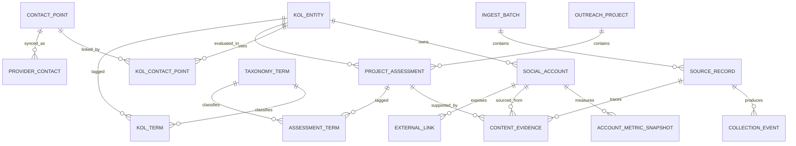

# Pippit KOL 标准化数据设计方案

版本：1.0  
日期：2026-07-17  
适用范围：`kol-outreach` 当前 FastAPI + SQLAlchemy 项目；生产 PostgreSQL，开发/测试 SQLite

## 1. 结论与推荐路线

当前 Excel 的一行同时承载 KOL 主体、平台账号、动态指标、项目适配、标签、联系方式、外链、证据和采集过程，不能直接作为生产主表。建议采用“主数据 + 多值子表 + 时间快照 + 项目评估 + 采集血缘”的标准化结构，并保留原始行用于审计和重放。

实施时不直接重命名或删除现有 `kol` 表。先建立新表并为 `kol` 增加映射外键，通过双写和兼容查询维持现有 `/api/kols`、Snov 同步、`thread.kol_id` 与前端功能；验证稳定后再切换读路径，最后收缩重复字段。

核心设计决定如下：

1. KOL 主体与平台账号分离：一个主体可以有多个 YouTube、Instagram、X 等账号。
2. 邮箱不再是 KOL 行上的单值属性：邮箱作为标准化联系点，通过关联表支持一个 KOL 多邮箱，也支持经纪公司邮箱服务多个 KOL。
3. 粉丝数和平均浏览量进入指标快照表，不能覆盖历史。
4. Pippit 适配、推荐角度和内容赛道属于项目评估，不写入全局 KOL 主数据。
5. 标签使用受控词表和关联表，不再以 `；` 拼接。
6. 邮箱、外链、内容证据逐项存储，不再以 `|` 拼接。
7. 原始 Excel 行进入采集暂存/血缘层；JSONB 只保存原始载荷和供应商扩展，不代替关系字段。
8. 生产迁移统一改用 Alembic；禁止继续用 `create_all()` 或启动时 `ALTER TABLE` 升级生产库。

## 2. 输入数据与现状基线

### 2.1 Excel 数据画像

源工作簿：`Pippit达人名单!A1:W101`，共 100 行、23 列。

| 项目 | 观察结果 | 设计影响 |
|---|---:|---|
| 平台分布 | YouTube 66、Twitter/X 20、Instagram 14 | 平台必须使用稳定代码；显示名与代码分离 |
| 联系邮箱 | 34 行有值、66 行为空 | 无邮箱的 KOL 也必须允许入库，联系点可为空 |
| 邮箱拆分 | 34 行包含 43 个候选值；6 行为多值；标准化后约 42 个不同候选值 | 使用 `contact_point` 与关联表，不用单列 |
| 邮箱污染 | 出现 `n8n@2.30.4`、尾部乱码和公共支持邮箱；`help@skool.com` 重复 | 不得只用宽松正则；需要语法、边界、域名和人工复核状态 |
| 公开外链 | 54 行有值，共 114 个链接；28 行为多值 | 拆入 `external_link`，保存原值和规范化值 |
| 主页/来源 | 100 行的“主页链接”和“来源链接”相同 | 来源关系应单独表达，避免重复存储 URL |
| 10 天平均浏览量 | 77 行有值、23 行为空，其中 4 行为 0 | `NULL` 表示未知，0 表示观测值确为 0，不得互换 |
| 国家/地区 | 30 行为 `Unknown`；还混入城市、口号、emoji 和虚构地点 | 国家代码、地区文本和原始值必须分列 |
| 数据更新时间 | 全部为 Excel 序列值 46217，即 2026-07-14 | 导入层统一解析为 UTC 时间/日期 |
| 采集时间 | 11 行为数值日期；另有 `2026-07-14 23:56:62` 非法秒值及后续日期漂移 | 不可信时间进入隔离队列，不自动静默修正 |
| 达人类别 | 4 个稳定值 | 可转为受控词表 |
| 内容赛道 | 8 个稳定值 | 作为项目评估标签，而非 KOL 永久属性 |
| 适配 Pippit | 100 行均为 `✓` | 当前文件只是已筛选集合；不能据此设计只有 true 的全局字段 |
| 推荐产品 | 100 行均为 Pippit | 产品/项目外键代替重复字符串 |

注意：上述邮箱数量是“候选值”统计，不等于可发送邮箱数量。导入后只有通过语法与业务校验的记录才能成为 `usable`。

### 2.2 当前数据库与代码约束

当前代码以单表 `kol` 同时承载爬虫字段、Snov 联系人字段、平台字段和营销状态，并保留多组重复语义：

- `name` / `full_name`
- `channel_url` / `profile_url`
- `subscribers` / `followers`
- `niche` / `content_category`
- 单值 `email`、`phones`、`linkedin_url`
- Snov 名单、原始载荷和业务主数据混在 `kol`

现有项目规范已经要求：生产只使用 PostgreSQL、SQLite 仅用于开发测试；邮箱规范化后数据库唯一；时间以 UTC 存储；枚举在应用层和数据库层校验；生产结构变更使用 Alembic；KOL 删除需要明确策略。

本方案将这些要求视为硬约束，并补充以下实现修正：

- SQLAlchemy 模型把 `kol.email` 声明为 `nullable=False`，但本地现有 SQLite 表实际允许空值；迁移前必须做 schema drift 检查。
- 邮箱唯一性目前主要依赖迁移脚本中的函数索引，模型元数据没有完整表达；新结构改为显式 `value_normalized` 列及唯一约束。
- `datetime.utcnow()` 产生无时区时间；新字段使用 `DateTime(timezone=True)` 和数据库默认时间。
- SQLite 开发连接必须启用 `PRAGMA foreign_keys=ON`，否则无法验证生产外键行为。
- PostgreSQL 使用 `JSONB` 保存原始载荷；SQLite 使用 SQLAlchemy `JSON` 兼容，但业务字段仍必须落普通列。

## 3. 目标逻辑模型



### 3.1 分层

| 层 | 表 | 作用 |
|---|---|---|
| 主数据 | `kol_entity`, `social_account`, `contact_point`, `kol_contact_point` | 稳定身份、账号与联系方式 |
| 指标 | `account_metric_snapshot` | 随时间变化的粉丝和浏览指标 |
| 项目 | `outreach_project`, `project_assessment`, `content_evidence` | Pippit 专属判断与证据 |
| 分类 | `taxonomy_term`, `kol_term`, `assessment_term` | 受控词表与多标签 |
| 链接 | `external_link` | 账号公开外链及用途 |
| 血缘 | `ingest_batch`, `source_record`, `collection_event` | 文件、原始行、采集结果和错误 |
| 供应商 | `provider_contact`, `provider_list_membership` | Snov 等外部系统映射 |
| 现有业务 | `thread`, `message`, `note`, `send_log`, `operator` | 邮件外联业务，迁移期间保持兼容 |

## 4. 表级设计

所有表使用 `snake_case`；与现有单数表名保持一致。主键沿用 `INTEGER`，避免 SQLite 的 `BIGINT` 自增差异。所有业务表至少包含 `created_at TIMESTAMPTZ NOT NULL`、`updated_at TIMESTAMPTZ NOT NULL`；需要软删除的主实体增加 `deleted_at TIMESTAMPTZ NULL`。

### 4.1 `kol_entity`：KOL 主体

| 字段 | 类型 | 约束/说明 |
|---|---|---|
| `id` | integer | PK |
| `entity_type` | varchar(30) | `person/channel/media/organization`; CHECK |
| `display_name` | varchar(300) | NOT NULL |
| `legal_name` | varchar(300) | 可空 |
| `country_code` | char(2) | 可空；ISO 3166-1 alpha-2 大写 |
| `locality` | varchar(200) | 城市/地区；不得塞入 `country_code` |
| `country_raw` | varchar(200) | 原始值，仅用于审计和待清洗 |
| `primary_language_code` | varchar(35) | BCP 47，例如 `en`、`en-US` |
| `lifecycle_status` | varchar(30) | `active/inactive/blocked/merged`; CHECK |
| `merged_into_id` | integer | FK `kol_entity.id`; 仅 `merged` 可填 |
| `created_at/updated_at/deleted_at` | timestamptz | UTC |

不在此表保存平台 handle、粉丝数、Pippit 适配、单个邮箱或 Snov 原始 JSON。

### 4.2 `social_account`：平台账号

| 字段 | 类型 | 约束/说明 |
|---|---|---|
| `id` | integer | PK |
| `kol_entity_id` | integer | FK，NOT NULL，删除主体时 RESTRICT/软删除 |
| `platform_code` | varchar(30) | `youtube/x/instagram/tiktok/linkedin/website/other`; CHECK 或词表 |
| `external_account_id` | varchar(200) | 平台稳定 ID，优先使用 |
| `handle` | varchar(200) | 原始展示 handle |
| `handle_normalized` | varchar(200) | 小写、去平台前缀；不移除有意义字符 |
| `platform_account_key` | varchar(300) | NOT NULL；优先外部 ID，否则规范化 handle |
| `display_name` | varchar(300) | 平台昵称 |
| `profile_url` | varchar(2048) | 原始可访问 URL |
| `profile_url_normalized` | varchar(2048) | 规范化 scheme/host/trailing slash/tracking 参数 |
| `is_primary` | boolean | 同一 KOL 可有一个主账号 |
| `is_active` | boolean | 默认 true |
| `last_observed_at` | timestamptz | 最近抓取时间 |

约束与索引：

- `UNIQUE(platform_code, platform_account_key)`。
- `INDEX(kol_entity_id, is_primary)`。
- 应用层保证同一主体最多一个 `is_primary=true`；PostgreSQL 用部分唯一索引实现。

### 4.3 `account_metric_snapshot`：账号指标快照

| 字段 | 类型 | 约束/说明 |
|---|---|---|
| `id` | integer | PK |
| `social_account_id` | integer | FK，NOT NULL |
| `observed_at` | timestamptz | NOT NULL，UTC |
| `followers_count` | bigint | 可空，CHECK >= 0 |
| `average_views` | bigint | 可空，CHECK >= 0 |
| `average_views_window_days` | smallint | 本文件为 10；CHECK > 0 |
| `source_record_id` | integer | FK，可追溯原始行 |
| `measurement_method` | varchar(30) | `api/scrape/manual/import` |

唯一键：`(social_account_id, observed_at, average_views_window_days, source_record_id)`。未知值保持 `NULL`，不得转换为 0。

### 4.4 `contact_point` 与 `kol_contact_point`：联系方式

`contact_point`：

| 字段 | 类型 | 约束/说明 |
|---|---|---|
| `id` | integer | PK |
| `contact_type` | varchar(20) | `email/phone`; CHECK |
| `value_raw` | varchar(500) | 原始值 |
| `value_normalized` | varchar(500) | NOT NULL；邮箱小写、去空格；电话 E.164 |
| `validation_status` | varchar(30) | `candidate/valid/invalid/risky/needs_review` |
| `deliverability_status` | varchar(30) | `unknown/verified/catch_all/bounced/blocked` |
| `is_business` | boolean | 可空；避免无依据推断 |
| `verified_at` | timestamptz | 可空 |
| `last_seen_at` | timestamptz | 可空 |

约束：`UNIQUE(contact_type, value_normalized)`。邮箱最大长度按 320 设计；这里保留 500 是为了统一联系点和隔离异常值，进入 `valid` 前应用层须限制为 320。

`kol_contact_point`：

| 字段 | 类型 | 约束/说明 |
|---|---|---|
| `kol_entity_id` | integer | FK，联合 PK |
| `contact_point_id` | integer | FK，联合 PK |
| `relationship_type` | varchar(30) | `owner/team/agency/general/support/unknown` |
| `is_primary` | boolean | 同一 KOL 每种 contact type 最多一个主联系点 |
| `confidence_score` | numeric(5,4) | 0–1 |
| `source_record_id` | integer | FK |
| `source_url` | varchar(2048) | 联系信息出处 |
| `collected_at` | timestamptz | UTC |

该结构允许 `help@skool.com` 只存一次，并关联多个主体，同时标记为 `support/risky`，不会误当成多个 KOL 的唯一身份。

### 4.5 `outreach_project` 与 `project_assessment`

`outreach_project` 保存 `code`、`name`、`product_name`、`status`、`starts_at`、`ends_at`。本文件对应一条 `code='pippit_2026'` 的项目记录。

`project_assessment`：

| 字段 | 类型 | 约束/说明 |
|---|---|---|
| `id` | integer | PK |
| `project_id` | integer | FK，NOT NULL |
| `kol_entity_id` | integer | FK，NOT NULL |
| `fit_status` | varchar(30) | `candidate/fit/not_fit/needs_review` |
| `priority_code` | varchar(10) | `P0/P1/P2/P3` 或空；CHECK |
| `recommendation_angle` | text | 项目专属推荐内容角度 |
| `assessment_notes` | text | 结构化字段无法覆盖的人工说明 |
| `assessed_by` | integer | FK `operator.id`，自动导入可空 |
| `assessed_at` | timestamptz | UTC |
| `source_record_id` | integer | FK |

约束：`UNIQUE(project_id, kol_entity_id)`。Excel 的“达人类别”“内容赛道”进入 `assessment_term`，不直接复制为自由文本列。

### 4.6 `taxonomy_term`、`kol_term`、`assessment_term`

`taxonomy_term` 字段：`id`、`taxonomy_type`、`code`、`display_name`、`parent_id`、`is_active`、审计时间；唯一键 `(taxonomy_type, code)`。

推荐的 `taxonomy_type`：

- `kol_category`：Excel 的达人类别。
- `content_track`：Excel 的内容赛道。
- `creator_role`：从“社会身份/头衔备注”拆出的导演、Filmmaker、VFX、AI 教育等。
- `language`：需要多语言时使用；单一主语言仍可放主表。

`kol_term(kol_entity_id, taxonomy_term_id, source_record_id)` 用于稳定身份/角色；`assessment_term(project_assessment_id, taxonomy_term_id, source_record_id)` 用于项目专属类别和赛道。两张关联表均使用复合唯一约束防重。

### 4.7 `content_evidence`

| 字段 | 类型 | 约束/说明 |
|---|---|---|
| `id` | integer | PK |
| `project_assessment_id` | integer | FK，NOT NULL |
| `social_account_id` | integer | FK，可空 |
| `evidence_type` | varchar(30) | `content_title/content_url/profile_text/manual_note` |
| `title` | varchar(1000) | 单条标题，不得拼接多条 |
| `url` | varchar(2048) | 可空 |
| `published_at` | timestamptz | 可空 |
| `source_record_id` | integer | FK |
| `position` | smallint | 保留源顺序 |

Excel 的“内容证据”按实际分隔符拆分、去除同一行完全重复标题后逐条写入。无法可靠拆分时保留为一条 `manual_note`，不得猜测标题边界。

### 4.8 `external_link`

字段：`id`、`social_account_id`、`link_type`、`url_raw`、`url_normalized`、`domain`、`source_record_id`、`first_seen_at`、`last_seen_at`。唯一键建议 `(social_account_id, url_normalized)`。

`link_type` 可取 `website/store/community/patreon/portfolio/newsletter/podcast/social/other`。短链可以保留原 URL；如异步解析重定向，另存 `resolved_url`，不得导入时阻塞请求。

### 4.9 采集血缘表

`ingest_batch`：

- `id`、`source_system`、`file_name`、`file_sha256`、`schema_version`。
- `status`：`received/validating/staged/imported/partial/failed/rolled_back`。
- `total_rows`、`accepted_rows`、`rejected_rows`、`started_at`、`finished_at`、`created_by`。
- `UNIQUE(source_system, file_sha256)`，实现文件级幂等。

`source_record`：

- `id`、`ingest_batch_id`、`source_row_number`、`raw_payload JSONB/JSON`。
- `record_fingerprint`、`validation_status`、`error_codes JSONB/JSON`、`warning_codes JSONB/JSON`。
- `source_updated_at`、`collected_at`、`normalized_at`。
- `UNIQUE(ingest_batch_id, source_row_number)` 和 `INDEX(record_fingerprint)`。

`collection_event`：

- `id`、`source_record_id`、`social_account_id`、`collector_name`、`collector_version`。
- `collection_status`：`success/verification_required/failed/partial`。
- `contact_discovery_status`：`found/not_found/needs_verification/invalid`。
- `started_at`、`finished_at`、`error_code`、`error_detail_sanitized`。

### 4.10 Snov 供应商映射

把当前 `kol.snov_*` 字段逐步迁出：

- `provider_contact(id, provider_code, external_contact_id, contact_point_id, raw_payload, last_synced_at)`，唯一键 `(provider_code, external_contact_id)`。
- `provider_list(id, provider_code, external_list_id, name)`。
- `provider_list_membership(provider_contact_id, provider_list_id, first_seen_at, last_seen_at)`。

供应商原始字段保留在 `raw_payload`，常用筛选字段必须标准化到关系列，避免 JSON 查询成为主要业务路径。

> **Snov 实测约束**（见 `DATA_CONSTRAINTS.md` §1.1，2026-07-17 实测 275 行）：本 Snov 账号的 `prospect-list` 实际只返回 6 个顶层字段（`id/name/firstName/lastName/source/emails`）。`country/position/companyName/locality/phones/socialLinks.linkedIn/customFields` 均 **0 行返回**，且 `customFields` 未配置（283 行全 NULL）。因此：
> - `snov_contacts.py` 中对 country/position/company 等的映射是死映射，迁移时不要为其建专用关系列，只留在 `raw_payload`。
> - 凡 platform/followers/priority 等画像字段，只能来自 Excel，不得假设 Snov 能提供。
> - 不做 Excel → Snov customFields 的回写（CONSTRAINTS §4.1 已定）。

## 5. Excel 23 列到目标模型的映射

| Excel 列 | 目标字段/表 | 转换规则 |
|---|---|---|
| 平台 | `social_account.platform_code` | `YouTube→youtube`、`Twitter/X→x`、`Instagram→instagram` |
| 账号 | `social_account.handle`, `handle_normalized` | 保留原值；规范化时去首尾空格，平台规则处理 `@` |
| 昵称 | `social_account.display_name`；首次可回填 `kol_entity.display_name` | 主体名和平台昵称分离 |
| 主页链接 | `social_account.profile_url(_normalized)` | 强制 HTTP(S)，host 小写，去追踪参数；不丢原值 |
| 粉丝数 | `account_metric_snapshot.followers_count` | 非负整数；未知为 NULL |
| 10天平均浏览量 | `average_views`, `average_views_window_days=10` | NULL 与 0 严格区分 |
| 国家/地区 | `country_raw` → `country_code/locality` | ISO 国家映射；城市与噪声进入待复核 |
| 语言 | `primary_language_code` 或词表 | `English→en` |
| 达人类别 | `assessment_term(kol_category)` | 受控词表 |
| 内容赛道 | `assessment_term(content_track)` | 受控词表 |
| 适配Pippit | `project_assessment.fit_status` | `✓→fit`；空/未知不得推断为 not_fit |
| 社会身份/头衔备注 | `kol_term(creator_role)` + `assessment_notes` | 以 `；` 拆分，映射稳定 code；无法映射部分保留备注 |
| 推荐内容角度 | `project_assessment.recommendation_angle` | 项目专属文本 |
| 主要推荐产品 | `outreach_project.product_name` | 本文件只建一条 Pippit 项目，不逐行重复 |
| 内容证据 | `content_evidence` | 单条拆分、去重、保序 |
| 来源链接 | `source_record` 的来源引用 | 与主页重复时不再复制业务字段 |
| 数据更新时间 | `source_record.source_updated_at` / 指标 `observed_at` | Excel 序列转 UTC；本文件为 2026-07-14 |
| 联系邮箱 | `contact_point` + `kol_contact_point` | 提取候选、严格校验、逐项入库；不自动把第一项设为可发送 |
| 邮箱状态 | `validation_status`/`contact_discovery_status` | 显式映射表；原文保留 |
| 邮箱来源 | `kol_contact_point.source_url` | “公开主页简介”作为 source type，不伪造成 URL |
| 公开外链 | `external_link` | 按 `|` 拆分、URL 规范化、去重 |
| 采集状态 | `collection_event.collection_status` | `成功→success`、`需要登录/验证→verification_required` |
| 采集时间 | `collection_event.finished_at` | 严格解析；非法秒和漂移日期进入隔离/复核 |

## 6. 数据标准与校验规则

### 6.1 缺失值

- 空字符串、纯空白、`Unknown`、`N/A`、`-` 在规范化列中写 `NULL`，原始值仍保存在 `source_record.raw_payload`。
- 数值未知必须为 `NULL`，不能用 0 代替。
- 布尔未知使用 `NULL` 或状态枚举，不把未知强制为 false。

### 6.2 邮箱

1. Unicode 规范化并去除首尾空白、`mailto:` 和明确的外围标点。
2. 使用成熟的邮箱校验库验证完整字符串边界；禁止从乱码长字符串中截取一个“看似合法”的子串。
3. 域名使用 IDNA 规范化；本地部分默认不擅自修改，只用于比较的规范化值转小写以兼容当前项目规则。
4. 公共支持、募款、平台帮助邮箱标记 `risky` 或 `needs_review`，不能自动设为主联系邮箱。
5. 只有 `validation_status=valid` 且未 bounced/blocked 的邮箱才可进入发信名单。

### 6.3 URL

- 仅接受 `http`/`https`；host 小写并做 IDNA。
- 删除 fragment 和已知跟踪参数；保留对资源定位有意义的 query。
- 原始、规范化和解析后 URL 分列，短链不在同步导入请求内展开。
- URL 最大长度按 2048 控制；超长值进入错误队列。

### 6.4 国家、地区和语言

- `country_code` 只存 ISO alpha-2；`United States→US`、`United Kingdom→GB`。
- `Boston, MA` 等写 `locality` 并在可确认时写 `US`。
- `👉`、`Slop City, Mars`、`Here, There, Everywhere...` 等只保留为 `country_raw` 并标记 `needs_review`。
- 语言采用 BCP 47；当前 `English→en`。

### 6.5 时间

- 数据库统一 `TIMESTAMPTZ`，应用层统一时区感知的 UTC `datetime`。
- 无时区 Excel 时间必须携带导入批次的 `source_timezone`（本文件按 Asia/Shanghai 解释），转换后存 UTC。
- Excel 序列值按 1900 日期系统显式解析。
- `23:56:62`、超范围日期、突然逐日递增但采集顺序为秒级等记录必须隔离；不允许静默“猜正确值”。

### 6.6 枚举与受控词表

- 稳定状态使用 `VARCHAR + CHECK`，避免 PostgreSQL 原生 ENUM 带来的升级成本，也保持 SQLite 兼容。
- 会持续扩展的业务分类使用 `taxonomy_term`，API 接收 code，不接收任意展示文本。
- Pydantic 校验与数据库 CHECK/唯一约束必须同时存在。

## 7. 索引、删除和并发规范

推荐索引：

- `social_account(platform_code, platform_account_key)` UNIQUE。
- `contact_point(contact_type, value_normalized)` UNIQUE。
- `project_assessment(project_id, kol_entity_id)` UNIQUE。
- `account_metric_snapshot(social_account_id, observed_at DESC)`。
- `kol_contact_point(kol_entity_id, is_primary)` 与 `kol_contact_point(contact_point_id)`。
- `source_record(ingest_batch_id, source_row_number)` UNIQUE。
- `provider_contact(provider_code, external_contact_id)` UNIQUE。
- 邮件业务保留现有 `message.message_id` UNIQUE，并补充 `thread(kol_entity_id, campaign_id)` 的查询索引。

删除策略：

- `kol_entity` 使用软删除；存在 `thread/message/send_log` 时禁止物理删除。
- 账号、标签、外链等从属主数据可在没有通信历史引用时级联删除。
- 联系点被多个 KOL 或历史消息引用时只解除关联，不删除联系点。
- 合并重复 KOL 时写 `merged_into_id`，迁移所有关联并保留审计记录。

并发与幂等：

- 导入批次按 SHA-256 幂等；行按 `(batch_id, row_number)` 幂等。
- Upsert 必须依赖数据库唯一键并处理 `IntegrityError`，不能只“先查再插”。
- 高频同步需要 `SELECT ... FOR UPDATE` 或 PostgreSQL `ON CONFLICT`；SQLite 测试只验证逻辑，不代表生产并发能力。

## 8. 与现有系统的兼容方案

### 8.1 兼容字段

迁移阶段给现有 `kol` 增加：

- `kol_entity_id` FK，可空后回填，再改为非空。
- `primary_social_account_id` FK，可空。
- `primary_contact_point_id` FK，可空。
- `row_version` integer，支持乐观并发控制。

现有字段暂时作为兼容投影：

| 旧字段 | 新数据来源 |
|---|---|
| `kol.name/full_name` | `kol_entity.display_name` |
| `channel_url/profile_url` | 主 `social_account.profile_url` |
| `subscribers/followers` | 最新 `account_metric_snapshot.followers_count` |
| `country` | `kol_entity.country_code` 或兼容显示值 |
| `niche/content_category` | 当前项目主分类的展示值 |
| `email` | 主 `contact_point.value_normalized` |
| `recent_videos` | 当前项目最近的 `content_evidence.title` 投影 |
| `snov_*` | `provider_contact` 与名单关联 |

迁移期间 API serializer 从新表读取，必要时回退旧字段；写入路径必须放在 service 层进行双写，不能散落在路由中。

### 8.2 会话表

`thread` 第一阶段保留 `kol_id`，新增：

- `kol_entity_id`：会话所属主体。
- `contact_point_id`：实际往来邮箱。

回填后新逻辑优先用两个新外键。`message.from_email/to_email` 可保留 RFC 原始头部值，但另加可空的 `from_contact_point_id/to_contact_point_id` 以便规范化查询。历史邮件地址不能因联系人更新而被覆盖。

### 8.3 API 版本

- 现有 `/api/kols` 保持响应兼容，修正列表响应属于另一个版本化工作项。
- 新标准化接口建议放在 `/api/v2/kols`，返回 `entity + accounts + contacts + latest_metrics + project_assessments`。
- 导入接口改为后台任务：上传 → 建立 `ingest_batch` → 校验预览 → 人工确认 → 提交；不得在请求内同步处理大量数据。

## 9. 迁移实施计划

### 阶段 0：建立迁移基线

1. 引入 Alembic，对当前生产库执行 `stamp`，生成可复现基线。
2. 在 PostgreSQL staging 和 SQLite 测试库跑 schema drift 检查。
3. 备份生产库并完成一次恢复演练。
4. 停止向生产 `init_db()` 添加新的运行时 `ALTER TABLE`。

验收：新空库可由 Alembic 从零创建；旧库可从基线升级；升级/降级脚本在 staging 通过。

### 阶段 1：扩展结构

1. 创建主数据、指标、项目、词表、血缘和供应商表。
2. 为 `kol`、`thread` 增加新外键，但保持可空。
3. 建立所有 CHECK、FK、唯一约束和索引。
4. PostgreSQL 使用 `NOT VALID` FK/约束时，回填后再 `VALIDATE CONSTRAINT`，降低锁表风险。

### 阶段 2：回填与清洗

1. 每个现有 `kol` 生成或匹配 `kol_entity`。
2. 把平台字段写入 `social_account`，把当前计数写入首个快照。
3. 把有效邮箱写入 `contact_point`；可疑邮箱标记复核，不进入主联系点。
4. 把 Snov 外部 ID、名单和原始载荷迁入 provider 表。
5. 从 Excel 建立 `ingest_batch/source_record`，生成 Pippit 项目评估、标签、证据和外链。
6. 生成对账报告，不修改原始工作簿。

关键对账：源行 100；账号 100；项目评估 100；指标快照 100；联系邮箱候选与拒绝项逐项可追溯；任何数量差异都有明确错误代码。

### 阶段 3：双写与影子读

1. 把 CSV/XLSX、Snov 和手工编辑统一收口到 service 层。
2. 新旧结构同事务双写。
3. 后台对比旧 API 与新查询的名称、主邮箱、主账号、最新粉丝数和状态。
4. 记录差异指标，不在日志中输出完整邮箱或原始载荷。

### 阶段 4：切换读取

1. `/api/v2` 直接读新表。
2. 现有 `/api/kols` 改读兼容查询/服务，保持旧响应。
3. Snov 同步和邮件线程使用 `contact_point`、`kol_entity_id`。
4. 将 `kol_entity_id` 等核心外键改为 NOT NULL（不适用的历史异常记录先隔离）。

### 阶段 5：收缩旧结构

至少稳定运行一个发布周期后：

1. 停止写入 `full_name/profile_url/followers/content_category/snov_*` 等重复字段。
2. 删除旧字段前先发布不依赖它们的应用版本。
3. 破坏性迁移单独发布，禁止与读路径切换同一版本完成。
4. 可将 `kol` 保留为兼容映射表，或在所有外键切换后迁移为只读视图；具体选择需根据现有 Snov 和前端兼容期限决定。

## 10. PostgreSQL/SQLite 实现规范

SQLAlchemy 模型建议：

```python
created_at = mapped_column(
    DateTime(timezone=True), nullable=False, server_default=func.now()
)
updated_at = mapped_column(
    DateTime(timezone=True), nullable=False,
    server_default=func.now(), onupdate=func.now()
)
```

- 新模型使用 SQLAlchemy 2.x `Mapped[]` / `mapped_column()`；查询逐步改用 `select()` 和 `Session.get()`。
- PostgreSQL 原始载荷列用带 variant 的 `JSONB`，SQLite 回退 `JSON`。
- 不使用数据库原生 ENUM；使用字符串 code + CHECK/词表。
- 所有 FK 显式写 `ondelete`，ORM relationship 的 cascade 必须与数据库策略一致。
- SQLite 测试连接启用 foreign keys，并增加在 PostgreSQL staging 上运行的迁移与约束集成测试。
- 所有 migration revision 必须有 upgrade、可行的 downgrade、数据前置检查和执行后对账 SQL。

## 11. 测试与验收标准

### 11.1 导入测试

- 同一文件重复导入不产生重复批次或业务数据。
- 6 个多邮箱行逐项处理；非法/污染候选不会被部分截取为 valid。
- 28 个多外链行拆分后保持顺序并去重。
- 23 个缺失平均浏览量保持 NULL，4 个 0 保持 0。
- 国家噪声不进入 `country_code`。
- 非法 `23:56:62` 和日期漂移记录被拒绝或标记 `needs_review`。
- 同一行重复内容证据被去重，但不同来源的相同标题保留血缘。

### 11.2 数据库测试

- 邮箱大小写/空格变体触发 `contact_point` 唯一约束。
- 同平台同账号键不能重复；不同平台相同 handle 可以存在。
- 指标负数、非法状态、非法优先级被数据库拒绝。
- 有邮件历史的 KOL 不能物理删除。
- 一个共享经纪/支持邮箱可以关联多个 KOL，而联系点本身只存一条。

### 11.3 兼容验收

- 现有 KOL 列表、详情、Snov 同步、会话、统计和个性化开场白测试通过。
- 新旧查询的主名称、主邮箱、账号 URL、粉丝数对账一致率 100%，已批准例外除外。
- PostgreSQL 迁移、回滚和备份恢复在 staging 通过。
- 切换期间无未处理唯一冲突、孤儿外键或重复发送。

## 12. 本次范围与后续决策

本方案定义目标数据结构与迁移路径，不在本次直接修改生产数据库或现有 API。原列出的 5 项业务决策**已于 2026-07-17 全部确认**（见 `DATA_CONSTRAINTS.md` §4/§5），结论如下：

1. ✅ **KOL 主体边界**（对应 CONSTRAINTS §5 原则 9）：`entity_type` 先只建 `person` / `organization` 两类；频道/媒体视为 person 名下的 `social_account`，不单独建类型。
2. ✅ **主联系邮箱选择规则**（对应 CONSTRAINTS §4.2）：只发主邮箱；优先级 = 个人 > 商务 > 经纪；公共支持邮箱永不自动发，标 `risky`。
3. ✅ **Pippit 项目**：本次建一条 `code='pippit_2026'`；多产品关联表暂不建，待出现第二个产品再扩。
4. ✅ **退订/合规**（对应 CONSTRAINTS §5 原则 8）：用 `contact_point.deliverability_status` + 全局 `suppression_list`；退订即拉黑；暂不设自动删除期限。
5. ✅ **旧 API 兼容**（对应 CONSTRAINTS §5 原则 10）：`kol` 保留为兼容映射表至少一个发布周期，不急着转视图。

**阶段 5 应明确删除的冗余字段**（来自 CONSTRAINTS §5 原则 3）：`name/full_name`、`subscribers/followers`、`niche/content_category`、`channel_url/profile_url` 各保留一个，另一个删除或改为生成列。

推荐优先落地阶段 0–2。它们可以立即消除导入不可追溯、多值字段、指标覆盖和邮箱污染问题，同时不打断当前外联业务。
